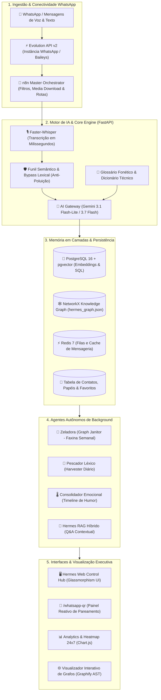

# 🏛️ Mnemosine — Titã da Memória & As 9 Musas da Inteligência Vocal

[](https://www.python.org/)
[](https://fastapi.tiangolo.com)
[](https://www.postgresql.org/)
[](https://www.docker.com/)
[](https://networkx.org/)
[](https://spacy.io/)
[](https://opensource.org/licenses/MIT)

> *"Sua voz não é apenas som: é o centro de comando e inteligência operacional do seu negócio."*

O **Mnemosine** é um ecossistema corporativo de inteligência conversacional, memória perpétua de longo prazo e copiloto executivo autônomo. Ele transforma mensagens e áudios do WhatsApp em **grafos relacionais de conhecimento, gestão acionável de tarefas, séries temporais de sentimentos, prosódia acústica e síntese estratégica** com precisão cirúrgica e **zero desperdício de tokens de IA**.

---

## 🎭 As 9 Musas do Mnemosine

O sistema organiza suas capacidades sob o governo das 9 Musas da mitologia clássica:

1. 📜 **Clio (História)**: Gestão de Contatos, Genealogia Organizacional e Ponderação Hierárquica.
2. 💃 **Terpsícore (Dança)**: Gestão de Tarefas, Planos de Ação e Movimento Operacional.
3. 🎙️ **Calíope (Eloquência)**: Transcrição Whisper, Player de Áudio e **Prosódia Acústica Ultra-Leve** (< 1.5ms).
4. 📖 **Polímnia (Hinos Sagrados)**: Dicionário Léxico Oficial, Vocabulário Técnico (C.Vale, Mtech) e Priming Dinâmico.
5. 🎭 **Erato (Poesia Amorosa & Afetos)**: Termômetro Social, Série Temporal e Sentimentos Calibrados.
6. 🧠 **Tália (Comédia & Festividades)**: Nuvem Semântica e Sintagmas Estratégicos com spaCy NLP.
7. 🌌 **Urânia (Astronomia)**: Grafo Cósmico de Conhecimento Relacional em NetworkX.
8. ⚡ **Melpômene (Tragédia)**: Auditoria Executiva, RAG Híbrido e Resolução de Gargalos Críticos.
9. 🎵 **Euterpe (Música & Poesia Lírica)**: Lore do Sistema, Harmonia das Musas e Mitologia do Mnemosine.

---

## 🎯 Por Que o Hermes? (O Pitch do Produto)

No agronegócio, na gestão executiva e nas operações de alta velocidade, **90% dos direcionamentos críticos acontecem por mensagens e áudios de WhatsApp**. O resultado? Informações perdidas em conversas dispersas, tarefas esquecidas e sobrecarga cognitiva.

O Hermes é a solução corporativa definitiva:

```
                  ┌────────────────────────────────────────────────────────┐
                  │   🎙️ ÁUDIOS & NOTAS DO WHATSAPP                       │
                  └─────────────────────────┬──────────────────────────────┘
                                            │
                                  ⚡ Transcrição Local
                                  🧠 Funil Semântico
                                            │
                  ┌─────────────────────────┴──────────────────────────────┐
                  ▼                                                        ▼
    ┌───────────────────────────┐                            ┌───────────────────────────┐
    │  🕸️ Grafo de Conhecimento  │                            │  📋 Tarefas & Governança  │
    │  Pessoas, Empresas e Nós  │                            │  Quem pediu, prazo e foco │
    └───────────────────────────┘                            └───────────────────────────┘
                  ▲                                                        ▲
                  └─────────────────────────┬──────────────────────────────┘
                                            │
                  ┌─────────────────────────┴──────────────────────────────┐
                  │  👑 OWNER: Deferência total e prioridade executiva     │
                  │  ⭐ Favoritos: +10% de peso operacional no funil       │
                  │  🌡️ Termômetro Emocional: Monitoramento contínuo      │
                  └────────────────────────────────────────────────────────┘
```

### 💡 Os Diferenciais Competitivos
- 🚀 **Economia Inteligente de Tokens (Funil Semântico)**: Descarta ruídos ("ok", saudações vazias, stickers, "Sem texto disponível") na borda, sem gastar tokens LLM ou poluir o banco.
- 👑 **Reconhecimento Supremo do Proprietário (`OWNER`)**: O sistema reconhece notas pessoais do Criador/Arquiteto (`Bruno Conter`), aplicando tom executivo de deferência, prontidão e lealdade máxima nos relatórios e Q&A.
- ⭐ **Sistema de Favoritos Ponderados**: Contatos marcados como favoritos ganham **+10% de peso de prioridade** imediata no motor de relevância.
- 🕸️ **Knowledge Graph em Tempo Real (NetworkX + Graphify)**: Modela quem fala com quem, projetos cruzados e conexões ocultas entre fazendas, cooperativas e departamentos.
- 🧹 **Agente Zeladora (`GraphJanitor`)**: Faxina autônoma semanal que remove ruídos temporais e funde aliases automaticamente.
- 🎙️ **Resiliência Extrema em Áudios Longos & Zero 502**: Fallback gracioso automático no AI Gateway (`POST /ai/revise`). Se o provedor de IA oscilar ou demorar, o WhatsApp recebe instantaneamente a transcrição pura do Whisper sem travar a pipeline.
- 📌 **Pós-Processamento Executivo de Áudios Extensos**: Áudios com mais de 350 caracteres recebem automaticamente formatação em tópicos acompanhada de uma síntese de **Destaques do Áudio** e **Ações Identificadas**, acelerando a tomada de decisão no WhatsApp.
- 🔒 **Privacidade & Soberania de Dados**: Deploy em infraestrutura híbrida privada (Homelab no Raspberry Pi + VPS dedicada).

---

## 🏗️ Arquitetura e Stack Tecnológica

O sistema opera em uma arquitetura distribuída, desacoplada e 100% conteinerizada (Cloud-Native / 12-Factor), pronta para deploy em **qualquer VPS Linux ou cluster Kubernetes (K8s/K3s)**:



### 🧩 Stack de Engenharia
| Camada | Tecnologia | Papel no Sistema |
| :--- | :--- | :--- |
| **Linguagem & Runtime** | Python 3.12+ / Linux | Desempenho nativo com suporte a tipagem estrita e asyncio |
| **API Framework** | FastAPI + Uvicorn | Servidor assíncrono de alto throughput com OpenAPI e endpoints RESTful |
| **Transcrição Local** | Faster-Whisper (CTranslate2) | Transcrição ultra-rápida de áudio (OGG/MP3/WAV/Base64) em CPU/GPU |
| **AI Gateway** | Google Gemini 3.1 Flash-Lite / 3.7 Flash | Extração de entidades (`NER`), classificação de intenções e RAG Híbrido |
| **Banco Relacional & Vetorial** | PostgreSQL 16 + pgvector | Persistência de mensagens, contatos, tarefas e busca semântica por cosseno |
| **Grafo Relacional** | NetworkX + Graphify | Modelagem de conexões inter-pessoais, detecção de comunidades e clusterização |
| **Orquestração & Mensageria** | n8n + Evolution API v2 | Ingestão de webhooks, download de mídia e bloqueio preliminar de grupos |
| **Interface & Analytics** | Vanilla JS + Glassmorphism CSS + Tailwind | Painel executivo responsivo e página reativa `/whatsapp-qr` |
| **Proxy Reverso & SSL** | Caddy v2 / K8s Ingress | Terminação TLS automática com HTTP/2 e compressão Gzip/Zstandard |

---

## 💎 Funcionalidades em Destaque

### 1. 👑 Papel `OWNER` (Proprietário Supremo)
- **Hierarquia Inviolável**: Peso $1.00$ com tratamento prioritário em todas as rotinas.
- **Reconhecimento de Notas Pessoais**: Identifica automaticamente áudios enviados para si mesmo (`fromMe: true` ou telefone do Bruno Conter), classificando como direcionamento estratégico.
- **Deferência no Agente Hermes**: O assistente responde com tom refinado, cortês e de alto alinhamento executivo.

### 2. ⭐ Contatos Favoritos com +10% de Peso
- **Priorização Dinâmica**: Qualquer contato favoritado no card web ganha **+10% sobre o peso base do seu papel** ($Effective = Base \times 1.10$).
- **Visual Diferenciado**: Cartões com moldura âmbar suave, tag `⭐ +10% Fav` e estrela interativa para toggle com 1 clique.

### 3. 🛡️ Funil Semântico & Threshold de Influência (Economia de Tokens)
- **Barreira de Identidade Prévia**: Nenhuma mensagem entra no AI Gateway ou na Memória se o remetente não tiver cartão cadastrado (`ContactRecord`).
- **Threshold de Sentimento & Humor (`SENTIMENT_WEIGHT_THRESHOLD = 0.70`)**:
  - Apenas pessoas de alto peso e influência na sua vida ($\ge 0.70$, como `OWNER`, `EXECUTIVE`, `FAMILY_CORE`, `PRODUCER_COOPERATED` ou contatos com **Estrela de Favorito**) ativam o gasto de tokens para inferência de sentimento e série temporal de humor.
  - Prestadores pontuais ou terceiros sem estrela têm análise emocional dispensada (`NEUTRAL` / `0.0`), poupando tokens e mantendo o termômetro de humor focado no que é estratégico.
- **Bloqueio de Mensagens Triviais**: Expressões de baixa relevância (*"bom dia"*, *"ok"*, *"blz"*, *"valeu"*, *"Sem texto disponível"*) são descartadas antes de chamar a IA.

### 4. 🎙️ Whisper com Dynamic Prompt Priming & Silero VAD Calibrado
- **Condicionamento de Vocabulário na Fonte**: Injeta termos oficiais (`C.Vale, eProdutor, Mtech, Agrocenter, Silo, Balança, Granja, Aviário, FAL, TMS, BRIM, FMIM, GASP, Plasson`) e contatos favoritos diretamente no `initial_prompt` do Whisper.
- **Eliminação de Alucinações Fonéticas**: O Whisper já transcreve sabendo quais palavras técnicas e nomes próprios existem no domínio.
- **VAD Tuned**: Silero VAD calibrado para ambientes com ruídos de aviários, compressores e trânsito.

### 5. 🕸️ GraphRAG Híbrido (pgvector + NetworkX 2-Hop + spaCy)
- **Extração Semântica da Query**: O spaCy extrai entidades, cargos, equipamentos e sintagmas nominais da pergunta do usuário.
- **Subgrafo Topológico de 2 Saltos**: Realiza travessia de 2 graus no NetworkX recuperando conexões estruturais completas (ex: `Valdecir` ➔ `SUPERVISIONA` ➔ `Granja` ➔ `CONTAINS` ➔ `Aviário 4` ➔ `EQUIPMENT` ➔ `Silo 3`).
- **Boost de Relevância**: Mensagens vetoriais correlacionadas às entidades do subgrafo ganham prioridade no re-ranqueamento.

### 6. ✂️ Compressão Extrativa com spaCy & Cache Semântico Local
- **Extractive Sentence Compressor (TextRank)**: Pontua e retém apenas as orações com alta densidade informacional (entidades, prazos, números e ações), podando fillers e reduzindo em **30% a 50% o consumo de tokens** em áudios longos.
- **Cache Semântico Local**: Responde perguntas frequentes com matching fuzzy ($\ge 94\%$) em $< 5\text{ms}$ com **Zero tokens**.

### 7. 🛡️ Guardrail Universal de Ortografia & Bloqueio Estrito de Nós
- **Validação Fonotática Universal**: Detecção de dígrafos invertidos (`hl`, `hn`), repetições ilegais (`bb`, `ff`, `xx`) e sequências sem vogais.
- **Auto-correção Fuzzy**: Termos com typos são auto-corrigidos para sua forma canônica (`senosr` ➔ `Sensor`, `fihlos` ➔ `Filho`).
- **Zero Nós com Erro**: Qualquer erro ortográfico não corrigível é sumariamente impedido de virar nó no grafo.

### 8. ⛏️ Mineração de Jargões, Categorias Dinâmicas & Mesclagem em Polímnia
- **Taxonomia Especializada com Teto de 12 Categorias**: Racionalização e descoberta dinâmica de categorias cruzando o Grafo de Urânia e spaCy NLP (`ZOOTECNIA_MANEJO`, `NUTRICAO_RACAO`, `LOGISTICA_SILOS`, `SISTEMAS_ERP`, `AGRONEGOCIO_COOP`, etc.).
- **Mesclagem Inteligente de Termos**: Agrupamento morfológico e fonético (singular/plural, maiúsculas para siglas, Title Case para entidades).
- **Descoberta Autônoma & Gerador Fonético**: Mineração com spaCy e geração automática de variações prováveis para priming do Whisper.

### 9. 💃 Gestão Avançada de Tarefas em Terpsícore
- **Filtro por Solicitante / Interlocutor**: Rastreabilidade precisa da origem de cada pendência.
- **Tags Contextuais Inteligentes**: Extração de tópicos e entidades via spaCy NLP e AI Gateway.
- **Exportação em PDF Formatado**: Geração de relatórios executivos de tarefas para compartilhamento rápido.
- **Mesclagem de Tarefas Similares por Pessoa**: Agrupamento de pendências correlatas com unificação de comentários e notas.

### 10. 🧠 Oráculo Melpômene: Query Engine Dinâmica & Humanizador de Respostas
- **Pré-Processamento Morfossintático (`HermesQueryUnderstanding`)**: Interpretação de intenções (`INTERLOCUTOR_DIALOGUE`, `TASK_LOOKUP`, `CONCEPT_STATUS`, `TIME_FILTER`) e resolução de interlocutores contra contatos e mensagens do banco.
- **Pós-Processamento Anti-Lixo Técnico (`HermesResponseHumanizer`)**: Purga profunda de UUIDs, metadados internos de banco, tags vCard e triplas brutas, aplicando polimento sintático com spaCy.
- **Síntese Cognitiva Local Extrativa (`LocalCognitiveSynthesizer`)**: Resumos executivos fluidos estruturados por tópicos temáticos (Equipamentos/Operação, Contato/Fornecedores, Acompanhamento/Retorno) com **0 custo de tokens de API**.

### 11. 🇧🇷 Alinhamento de Fuso Horário de Brasília (America/Sao_Paulo)
- Conversão precisa de todos os timestamps do banco para o Horário de Brasília (UTC-3), garantindo que consultas sobre "hoje" e "ontem" operem no fuso brasileiro sem distorções de UTC.

---

## 🚀 Instalação e Inicialização Rápida

### 1. Clonagem e Variáveis de Ambiente
```bash
git clone git@github.com:brunocorisco86/whisperzap.git
cd whisperzap

cp .env.example .env
# Preencha suas chaves no .env (GEMINI_API_KEY, DATABASE_URL, etc.)
```

### 2. Execução Local com Docker Compose
```bash
docker compose up -d --build
```
- **Hermes Control Hub**: `http://localhost:8005/`
- **Swagger API Docs**: `http://localhost:8005/docs`
- **Health Check**: `http://localhost:8005/health`

### 3. Execução de Testes Automatizados
```bash
pytest tests/ -v
```

---

## 📡 Principais Endpoints da API

| Método | Endpoint | Descrição |
| :--- | :--- | :--- |
| `POST` | `/transcribe` | Transcrição de áudio via Faster-Whisper com Dynamic Prompt Priming |
| `POST` | `/transcribe/base64` | Transcrição de áudio base64 com suporte a speaker e prompt |
| `POST` | `/ai/revise` | Revisão contextual de texto com jargões técnicos via AI Gateway |
| `GET` | `/api/v1/contacts` | Lista contatos reais com pesos calculados, status de favorito e sentimentos |
| `PATCH`| `/api/v1/contacts/{id}/favorite` | Alterna o status de favorito do contato (+10% de peso) |
| `DELETE`| `/api/v1/contacts/{id}` | Remove contato no SQL e purga nós associados no Grafo |
| `POST` | `/api/v1/memory/messages` | Salva mensagem com extração semântica e nós no Grafo |
| `GET` | `/api/v1/memory/tasks` | Lista tarefas com ancoragem de solicitante e anotações |
| `PATCH`| `/api/v1/memory/tasks/{id}` | Atualiza status (`DONE`, `CANCELLED`, `PENDING`) e anotações |
| `POST` | `/api/v1/memory/tasks/optimize-learner` | Dispara otimizador de tarefas com spaCy e agente LLM |
| `GET` | `/api/v1/memory/tasks/learner-rules` | Consulta regras ativas anti-ruído de tarefas |
| `POST` | `/api/v1/memory/graph/clean` | Dispara faxina da Zeladora (podas, fusão de aliases, deduplicação de cards e purga de órfãos) |
| `POST` | `/api/v1/memory/graph/hybrid-search` | Inspeção de subgrafo 2-hop e entidades extraídas para qualquer consulta |
| `POST` | `/api/v1/memory/query` | Consulta ao Hermes com GraphRAG Híbrido, cache semântico e citação de fontes |
| `GET` | `/api/v1/memory/token-savings` | Métricas em tempo real de tokens economizados |
| `GET` | `/api/v1/dictionary/suggestions` | Sugestões inteligentes de termos minerados com spaCy |
| `POST` | `/api/v1/dictionary/generate-phonetics` | Gerador de variações fonéticas para o Whisper |
| `GET` | `/api/v1/analytics/dashboard` | KPIs executivos, séries temporais, WordMap e Heatmap 24x7 |

---

## 📐 Modelo de Dados (MER / DER) & Privilégio de Identidade

```
 ┌────────────────────────┐         1:N         ┌─────────────────────────┐
 │        CONTACTS        │────────────────────<│        MESSAGES         │
 ├────────────────────────┤                     ├─────────────────────────┤
 │ id (PK: wa_{digits})   │                     │ id (PK: UUID)           │
 │ phone_number (Unique)  │                     │ speaker (FK -> Contact) │
 │ name, nickname, role   │                     │ raw_text, revised_text  │
 │ company, projects_json │                     │ intent, sentiment       │
 │ custom_weight          │                     │ audio_filename          │
 │ is_favorite (Boolean)  │                     │ meta_info (JSON)        │
 └────────────────────────┘                     └────────────┬────────────┘
             │                                               │
             │                                      1:N      │
             │                                  ┌────────────┴────────────┐
             │                                  │                         │
             ▼ 1:N                              ▼ 1:N                     ▼ 1:N
 ┌────────────────────────┐         ┌────────────────────────┐ ┌────────────────────────┐
 │         TASKS          │         │        ENTITIES        │ │       EMBEDDINGS       │
 ├────────────────────────┤         ├────────────────────────┤ ├────────────────────────┤
 │ id (PK: UUID)          │         │ id (PK: UUID)          │ │ id (PK: UUID)          │
 │ message_id (FK)        │         │ message_id (FK)        │ │ message_id (FK)        │
 │ assignee (FK -> Contact│         │ name, category         │ │ text_content           │
 │ title, due_date, status│         │ details, created_at    │ │ embedding (Vector 768) │
 └────────────────────────┘         └────────────────────────┘ └────────────────────────┘
```

> **Princípio Sagrado da Memória**: *A história é escrita pelos vitoriosos; contatos sem cartão oficial não geram conhecimento nem tarefas.*
> - Nenhuma mensagem entra no **AI Gateway** nem é salva na **Memória MUSA** se o remetente não for o **Proprietário (`Bruno Conter`)** ou um **Contato Oficial com Cartão Cadastrado** (`ContactRecord`).
> - A **Zeladora (`GraphJanitorService`)** realiza deduplicação contínua de cartões (resolvendo variações fonéticas e telefones com/sem DDI) e purga registros órfãos.

---

## 🗺️ Roadmap Estratégico & Ideação de Produto

- [x] **Privilégio Estrito de Identidade**: Bloqueio de grupos e filtro de entrada no AI Gateway baseado na tabela de contatos com cartão.
- [x] **Bonificação de Favoritos**: Multiplicador de +10% de peso sobre o papel para contatos favoritados.
- [x] **Deduplicação de Cards & Purga de Órfãos na Zeladora**: Fusão automática de duplicatas e eliminação de tarefas sem autor.
- [ ] **MUSA Intelligent Profile Enrichment (Edição Cognitiva de Cards via RAG)** *(Ideação Detalhada Abaixo)*
- [ ] **Voice Push Notifications**: Envio de alertas de voz sintetizados para tarefas de alta prioridade.
- [ ] **MUSA Graph Clustering Auto-Tuning**: Detecção automática de novas comunidades temáticas no Grafo Social.

---

### 💡 Ideação Arquitetural: MUSA Intelligent Profile Enrichment

```
 ┌────────────────────────┐
 │   Card do Contato na   │ ──(Usuário clica em "✨ Sugestão RAG")──┐
 │   Interface Web        │                                         │
 └────────────────────────┘                                         ▼
                                                   ┌─────────────────────────────────┐
                                                   │ 1. RAG Longitudinal MUSA        │
                                                   │    - Varredura de 90 dias       │
                                                   │    - Vizinhos no Grafo NetworkX │
                                                   │    - Tarefas & Sentimentos      │
                                                   └────────────────┬────────────────┘
                                                                    │
                                                                    ▼
                                                   ┌─────────────────────────────────┐
                                                   │ 2. Hermes Synthesis Engine      │
                                                   │    - Deduz papel ideal e peso   │
                                                   │    - Identifica novos projetos  │
                                                   │    - Mapeia empresas e fazendas │
                                                   │    - Gera dossiê de notas       │
                                                   └────────────────┬────────────────┘
                                                                    │
                                                                    ▼
 ┌────────────────────────┐                        ┌─────────────────────────────────┐
 │   Card Atualizado e    │ ◄──(Aprovação "1-Clique")│ 3. Painel Diff (Antes vs Depois)│
 │   Grafo Calibrado      │                        │    - Recomendações prontas      │
 └────────────────────────┘                        └─────────────────────────────────┘
```

#### 1. A Oportunidade
Conforme os meses avançam, a **MUSA** acumula dezenas de mensagens, intenções e conexões sobre cada parceiro, produtor rural ou executivo. Manter o perfil dos contatos (cargo, projetos ativos, empresa, notas de comportamento) atualizado manualmente é demorado.

#### 2. Como Funciona a Experiência (UX)
1. **Acionamento Human-in-the-Loop**: Ao abrir o modal de um contato com mais de 10 interações registradas, o botão **`✨ Sugestão Cognitiva (RAG MUSA)`** fica destacado.
2. **Análise Multi-Modal**:
   - **Camada Vetorial (`pgvector`)**: Analisa todas as transcrições e mensagens do interlocutor.
   - **Camada Estrutural (Grafo MUSA)**: Analisa com quem ele se conecta (quais silos, sistemas, fazendas e outras pessoas ele cita).
   - **Série Temporal de Humor**: Analisa a estabilidade emocional e padrões de urgência.
3. **Proposta Estruturada da IA**:
   - **Papel Hierárquico Recomendado**: ex: sugere migrar de `COLLEAGUE` para `EXECUTIVE` devido a decisões de compras e alinhamento de diretoria.
   - **Empresa / Unidade**: Detecta menções a *"C.Vale Palotina"*, *"Fazenda São Bento"*, etc.
   - **Projetos Ativos**: Extrai tags dinâmicas como `["Silo 4", "Auditoria Miratorg", "Calibração Sensores"]`.
   - **Dossiê / Anotações**: Redige um resumo executivo com pontos fortes, estilo de comunicação e preferências operacionais.
4. **Aprovação em 1-Clique**: O usuário vê o comparativo visual do que mudou e aprova com um único clique, atualizando o SQL e rebalanceando os pesos do Grafo de Conhecimento.

---

## 👥 Governança & Créditos

- **Criador, Proprietário & Arquiteto**: Bruno Conter
- **Domínio de Aplicação**: Gestão Operacional, Inteligência de Agronegócio e Homelab Executivo
- **Repositório Oficial**: [github.com/brunocorisco86/whisperzap](https://github.com/brunocorisco86/whisperzap)
- **Licença**: MIT
