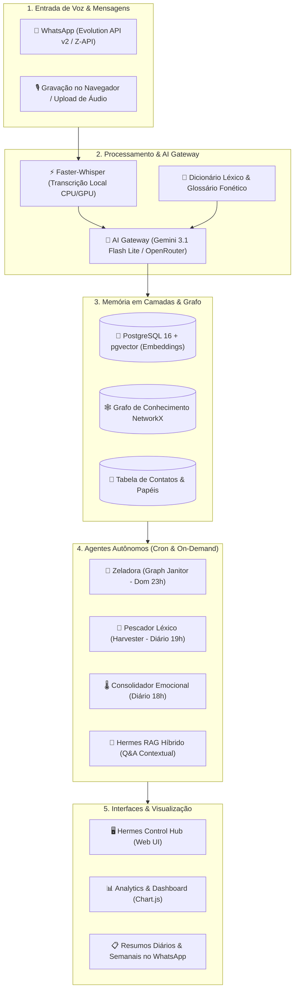

# 🏛️ Hermes Voice Memory — Voice Memory & Knowledge Graph System

[](https://www.python.org/downloads/)
[](https://fastapi.tiangolo.com)
[](https://www.postgresql.org/)
[](https://www.docker.com/)
[](https://opensource.org/licenses/MIT)

> **Hermes Voice Memory** é um ecossistema inteligente de copiloto de voz, memória de longo prazo e inteligência estratégica, projetado para transformar mensagens e áudios do WhatsApp em conhecimento relacional, tarefas acionáveis e análises em tempo real para o agronegócio e a gestão executiva.

---

## 🧭 Sumário Executivo

O Hermes resolve a dispersão de informações e a sobrecarga cognitiva na comunicação operacional diária:
1. **Transcrição & Revisão Contextual**: Processa áudios em milissegundos via `faster-whisper` e corrige termos técnicos com **Gemini 3.1 Flash Lite**;
2. **Memória em Camadas**: Persiste mensagens estruturadas no **PostgreSQL 16 com pgvector** (embeddings vetoriais) e modela entidades e relacionamentos no **Grafo NetworkX**;
3. **Ancoragem de Solicitante & Tarefas**: Vincula quem originou cada demanda, permitindo anotações persistentes, status dinâmico e integração com WhatsApp;
4. **Agentes Autônomos em Background**:
   * 🧹 **Agente Zeladora (`GraphJanitor`)**: Faxina semanal automática no Grafo aos Domingos às 23:00, podando ruídos e unificando aliases;
   * 🎣 **Agente Pescador Léxico (`LexicalHarvester`)**: Pesca diária de jargões técnicos às 19:00 com sugestão de termos;
   * 🌡️ **Série Temporal de Sentimentos**: Monitoramento emocional contínuo às 18:00;
   * 🧠 **Agente Hermes**: RAG Híbrido contextual com resposta a perguntas e citações exatas;
5. **Analytics & Dashboard Executivo**: Visualização em **Chart.js** com agrupamento temporal (Dia, Semana, Mês), Nuvem de Palavras semântica (*WordMap*) e Matriz de Horários de Pico (*Heatmap 24x7*).

---

## 🏗️ Arquitetura do Sistema



---

## 📊 Fases do Roadmap Entregues (100% Concluído)

| Fase | Descrição | Status |
| :--- | :--- | :---: |
| **Fase 1** | Setup de Infraestrutura Local, Governança e Testes (`pytest`) | ✅ Concluído |
| **Fase 2** | MVP 1 — Transcrição de Áudio WhatsApp & AI Gateway | ✅ Concluído |
| **Fase 3** | Repositório Remoto & Sincronização Git Push Contínua | ✅ Concluído |
| **Fase 4** | Memória em Camadas (PostgreSQL + pgvector + NetworkX) | ✅ Concluído |
| **Fase 5** | API Memory, Agente Hermes (RAG Híbrido) & Relatórios WhatsApp | ✅ Concluído |
| **Fase 6** | Deploy de Produção em VPS Alpine Linux com Caddy e Docker Compose | ✅ Concluído |
| **Fase 7** | Analytics, Métricas & Dashboard Executivo com Chart.js | ✅ Concluído |
| **Bônus** | Agente Zeladora (Graph Janitor) & Faxina Semanal no Grafo | ✅ Concluído |

---

## 🤖 Agentes Especializados

### 1. 🧹 Agente "Zeladora" (`GraphJanitorService`)
* **Propósito**: Manter o Grafo de Conhecimento enxuto, consistente e livre de termos efêmeros e ruídos;
* **Regras de Faxina**:
  1. *Proteção Sagrada*: Contatos oficiais (`contacts`), empresas, projetos e nós com $\ge 3$ conexões nunca são deletados;
  2. *Poda de Efêmeros*: Remove marcadores temporais (*amanhã*, *ontem*, *segunda-feira*) e saudações;
  3. *Poda de Órfãos*: Remove nós isolados de baixo valor (`degree == 0` e `mentions <= 1`);
  4. *Fusão de Aliases*: Desambigua variações (ex: `silo 3` ➔ `Silo 3`) transferindo todas as arestas;
* **Agendamento**: Todo **Domingo às 23:00** via `cron_service.py` ou sob demanda na aba do Grafo no Control Hub.

### 2. 🎣 Agente "Pescador Léxico" (`LexicalHarvester`)
* **Propósito**: Identificar termos técnicos e fonéticos não catalogados no dia a dia;
* **Agendamento**: Diário às **19:00**.

### 3. 🧠 Agente Hermes (`HermesAgentService`)
* **Propósito**: RAG Híbrido combinando busca vetorial semântica, busca direta por interlocutor (`speaker match`), ancoragem de tarefas pendentes e conexões do Grafo NetworkX.

---

## 🛠️ Instalação e Execução

### 1. Pré-requisitos
* Python 3.12+
* Docker & Docker Compose
* FFmpeg instalado (`sudo apt install ffmpeg`)

### 2. Configuração Local
```bash
# Clone o repositório
git clone git@github.com:brunocorisco86/whisperzap.git
cd whisperzap

# Crie o ambiente virtual
python3 -m venv .venv
source .venv/bin/activate

# Instale as dependências
pip install -r requirements.txt

# Configure as variáveis de ambiente
cp .env.example .env

# Execute os testes automatizados
pytest
```

### 3. Execução do Servidor
```bash
uvicorn src.main:app --host 0.0.0.0 --port 8000 --reload
```
* **Control Hub**: `http://localhost:8000/`
* **Swagger API Docs**: `http://localhost:8000/docs`
* **Pareamento WhatsApp**: `http://localhost:8000/whatsapp/qr`

### 4. Deploy em Produção (Docker Compose)
```bash
docker compose up -d --build
```

---

## 📡 Principais Endpoints da API

| Método | Endpoint | Descrição |
| :--- | :--- | :--- |
| `POST` | `/transcribe` | Transcrição de áudio via Faster-Whisper |
| `POST` | `/ai/revise` | Revisão contextual de texto via AI Gateway |
| `POST` | `/api/v1/memory/messages` | Salva mensagem com extração semântica e nós no Grafo |
| `GET` | `/api/v1/memory/messages` | Feed de mensagens com metadados e áudio |
| `GET` | `/api/v1/memory/tasks` | Lista tarefas com ancoragem de solicitante e anotações |
| `PATCH`| `/api/v1/memory/tasks/{id}` | Atualiza status (`DONE`, `CANCELLED`, `PENDING`) e notas |
| `GET` | `/api/v1/analytics/dashboard` | Dados do Dashboard (KPIs, Séries, Top Contatos, WordMap, Heatmap) |
| `POST` | `/api/v1/memory/graph/clean` | Dispara faxina da Zeladora no Grafo de Conhecimento |
| `GET` | `/api/v1/memory/graph/janitor/logs` | Consulta histórico de relatórios da Zeladora |
| `POST` | `/api/v1/memory/query` | Consulta contextual ao Hermes com RAG Híbrido |

---

## 👥 Contatos & Governança

* **Desenvolvido por**: Bruno Conter
* **Foco de Aplicação**: Gestão Operacional, Inteligência Avícola e Negócios C.Vale
* **Repositório**: [github.com/brunocorisco86/whisperzap](https://github.com/brunocorisco86/whisperzap)
