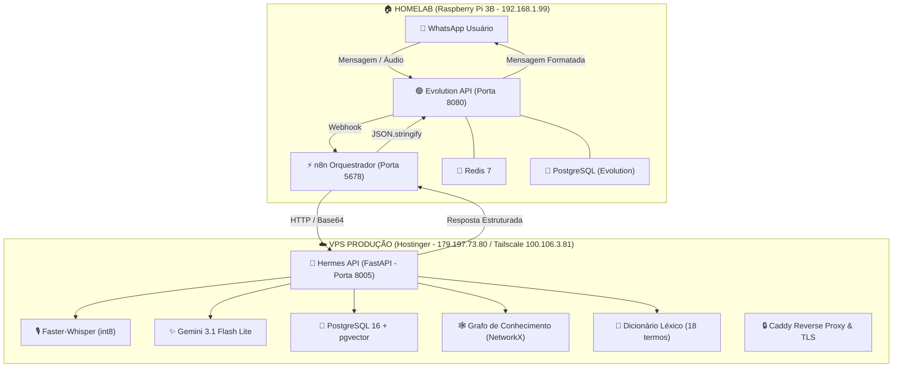

# 🏛️ Hermes Voice Memory — Manual de Arquitetura & Documento de Handoff

> **Documento Oficial de Handoff Técnico & Operacional**  
> **Versão:** 1.0.0 — Produção  
> **Data:** 15 de Agosto de 2026  
> **Repositório:** `https://github.com/brunocorisco86/whisperzap`

---

## 1. Visão Geral e Propósito do Sistema

O **Hermes Voice Memory** é um ecossistema inteligente de captura de voz, memória semântica e assistência executiva operacional. O sistema opera de forma autônoma e contínua conectando dois assistentes integrados ao **WhatsApp**:

1. **🎙️ James (Mordomo Virtual de Voz)**:
   - Captura notas de áudio enviadas pelo usuário via WhatsApp.
   - Descriptografa e converte o áudio em texto utilizando **Faster-Whisper** com dicionário léxico personalizado.
   - Revisa e formata a transcrição com IA (**Gemini 3.1 Flash Lite**).
   - Responde no WhatsApp com a transcrição estruturada em segundos e persiste o conteúdo na memória de longo prazo.

2. **🧠 Hermes (Copiloto Cognitivo & RAG Híbrido)**:
   - Responde a perguntas e comandos enviados no WhatsApp começando com o prefixo `?` (ex: `? quais as pendências da semana?`).
   - Realiza busca híbrida: **Vetorial (PostgreSQL 16 + pgvector)** + **Grafo de Conhecimento Semântico (NetworkX)**.
   - Sintetiza respostas executivas embasadas no histórico real de reuniões, contatos e projetos, sem alucinações.

---

## 2. Topologia de Infraestrutura (Homelab ⇄ VPS)



---

## 3. Detalhamento dos Servidores & Serviços

### ☁️ A. VPS de Produção (Hostinger)
* **Sistema Operacional:** Alpine Linux v3.22 (x86_64)
* **IP Público:** `179.197.73.80` | **IP Tailscale (Mesh VPN):** `100.106.3.81`
* **Diretório do Repositório:** `/root/projetos/whisperzap` (Symlink: `/opt/whisperzap`)
* **Containers Docker Ativos:**
  - **`hermes-api`** (Porta `8005:8000`): FastAPI, Faster-Whisper, Gemini AI Gateway, SQLAlchemy, NetworkX.
  - **`hermes-db`** (Porta `5432` interna): PostgreSQL 16 com extensão `pgvector` e tabelas: `contacts`, `embeddings`, `entities`, `messages`, `tasks`.
  - **`hermes-caddy`** (Portas `80` e `443`): Proxy Reverso e emissão automática de certificados SSL/TLS.
* **Rotina de Backup Automático:**
  - Agendado via cron diário às **03:00 UTC** (`scripts/backup_db.sh`).
  - Gera dumps comprimidos (`.sql.gz`) do banco e snapshots do grafo em `/root/backups/whisperzap/` com rotação de 7 dias.

### 🏠 B. Homelab (Raspberry Pi 3B — `ssh peixe`)
* **Sistema Operacional:** Alpine Linux (ARM64)
* **IP Local:** `192.168.1.99`
* **Diretório do Repositório:** `/root/whisperzap` (Symlink: `/opt/whisperzap`)
* **Containers Docker Ativos:**
  - **`hermes-evolution-api`** (Porta `8080`): Conector Baileys com WhatsApp. Instância pareada: `hermes` (Status: `open`).
  - **`hermes-n8n`** (Porta `5678`): Orquestrador visual de automações com `workflows/n8n_whatsapp_master_orchestrator.json`.
  - **`hermes-evolution-redis`** (Porta `6379`): Cache e gerenciamento de filas.
  - **`hermes-evolution-postgres`**: Banco de dados dedicado para autenticação do WhatsApp.
* **Otimizações de Hardware:**
  - Memória Swap de 1 GB ativada no `/etc/fstab`.
  - Limites de memória V8 configurados via `NODE_OPTIONS="--max-old-space-size=450"`.

---

## 4. Regras de Domínio & Inteligência Embarcada

O Hermes e o James operam com regras nativas do ecossistema de negócios do usuário:

1. **Logística de Ração & Eficiência Operacional**:
   - A solução é fundamentada em três pilares:
     - **Comunicação Eficiente**: Plataforma centralizada de pedidos e notificações.
     - **Processos Otimizados**: Redesenho do fluxo operacional e confirmação de pedidos.
     - **Tecnologia Habilitadora**: Roteirização via **TMS** e **sensores IoT de nível nos silos**.

2. **Zootecnia Avícola C.Vale**:
   - Monitoramento contínuo de: **Conversão Alimentar (CA)**, **Índice de Eficiência Produtiva (IEP)**, **Mortalidade diária na FAL (Ficha de Acompanhamento de Lote)**, **Alojamento de Pintainhos**, **Vazio Sanitário** e **Apanha/Abate**.

3. **Sistemas & Integrações Mtech**:
   - Integração com software **Mtech Systems** e banco **Amino (MS SQL Server)**, cobrindo os módulos **BRIM** (frango de corte) e **FMIM** (fábrica de ração) espelhados com o portal **Agrocenter** e **eProdutor**.

4. **Dicionário Léxico com Correção Fonética**:
   - 18 termos cadastrados em `data/lexical_dictionary.json` com mapeamento fonético determinístico (ex: *"Sevala"*, *"Sevale"*, *"Civale"* ➔ **`C.Vale`**; *"FAU"*, *"falo"* ➔ **`FAL`**).

---

## 5. Comandos e Endpoints de Referência

### 🚀 Endpoints da API Hermes (VPS — Porta 8005)

| Método | Endpoint | Descrição |
| :--- | :--- | :--- |
| `GET` | `/health` | Health check da API e conectividade com Postgres |
| `POST` | `/transcribe/base64` | Transcrição de áudio via Faster-Whisper |
| `POST` | `/ai/revise` | Revisão gramatical e estruturação léxica com Gemini |
| `POST` | `/api/v1/memory/query` | Consulta ao Agente Hermes (RAG + Grafo de Conhecimento) |
| `GET` | `/api/v1/memory/stats` | Estatísticas de mensagens, tarefas e nós do grafo |
| `GET` | `/api/v1/dictionary` | Listagem dos termos do dicionário léxico |
| `GET` | `/api/v1/dictionary/hints` | Prompts iniciais para o Whisper e contexto para LLMs |

### 🛠️ Comandos de Manutenção Rápida

```bash
# Na VPS Hostinger:
cd /root/projetos/whisperzap
docker compose ps
docker compose logs -f hermes-api

# No Raspberry Pi (peixe):
cd /opt/whisperzap
docker compose -f docker-compose.homelab-whatsapp.yml ps
docker compose -f docker-compose.homelab-whatsapp.yml logs -f n8n

# Executar backup manual imediato na VPS:
bash /root/projetos/whisperzap/scripts/backup_db.sh
```

---

## 6. Checklist de Continuidade & Sincronização

- [x] **VPS Hostinger**: Deploy com Docker Compose, Caddy TLS, PostgreSQL 16 + pgvector e Gemini 3.1 Flash Lite.
- [x] **Raspberry Pi**: Stack Homelab ativa, WhatsApp pareado (`open`), n8n ativo com Master Orchestrator.
- [x] **Dicionário Léxico**: 18 termos corporativos com regras de fonemas (C.Vale, FAL, TMS, Mtech).
- [x] **Backups Diários**: Agendados às 03:00 UTC na VPS com retenção de 7 dias.
- [x] **Sincronização Git**: Repositório `whisperzap` sincronizado em todos os ambientes.
