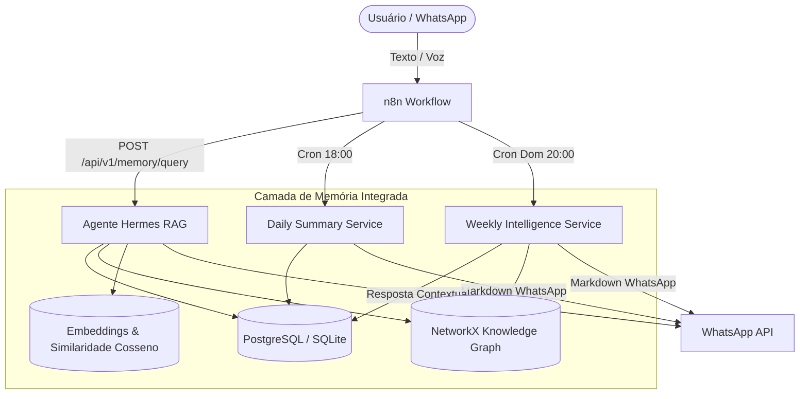

# 🧠 Fase 5: API da Memória, Agente Hermes & Automação de Relatórios

Este documento detalha o funcionamento, arquitetura e integração da **Fase 5** do **Hermes Voice Memory**, transformando a base de dados acumulada em inteligência executiva acionável.

---

## 🌟 1. Visão Geral da Arquitetura



---

## 🔍 2. Endpoints da API de Inteligência

### 2.1. Agente Hermes (RAG Híbrido) — `POST /api/v1/memory/query`

Realiza busca semântica vetorial, explora conexões de entidades no grafo e identifica pendências abertas para responder perguntas com fidelidade estrita.

**Exemplo de Requisição:**
```json
POST /api/v1/memory/query
{
  "query": "Quem é o responsável pelos sensores de silo e quais foram os últimos problemas?",
  "top_k": 5,
  "min_similarity": 0.0,
  "include_graph": true
}
```

**Exemplo de Resposta:**
```json
{
  "query": "Quem é o responsável pelos sensores de silo...",
  "answer": "De acordo com os registros de 14/08/2026, João Silva foi designado para verificar a calibração do sensor no Silo 3. Foi relatada oscilação na leitura de nível.",
  "sources": [
    {
      "message_id": "8f03bb78-a89e-4eb0-80a1-000000000001",
      "speaker": "5544999998888",
      "text_snippet": "João precisa verificar o sensor do silo 3 amanhã devido a oscilações.",
      "similarity": 0.8921,
      "created_at": "2026-08-14 14:30"
    }
  ],
  "related_entities": [
    "João Silva -[WORKS_WITH]-> Automação de Silos",
    "Sensor 3 -[BELONGS_TO]-> Silo 3"
  ],
  "pending_tasks_mentioned": [
    "Verificar sensor do silo 3 (Resp: João Silva) [Prazo: amanhã] [Prioridade: HIGH]"
  ],
  "provider": "gemini",
  "model": "gemini-2.5-flash-lite",
  "processing_time_ms": 182.4
}
```

---

### 2.2. Resumo Diário & Plano para Amanhã — `POST /api/v1/memory/daily/generate` e `GET /api/v1/memory/daily`

Consolida o dia útil às 18:00 e projeta as ações prioritárias para o dia seguinte formatadas diretamente para o WhatsApp.

**Exemplo de Texto Formatado para WhatsApp:**
```text
📅 *RESUMO DIÁRIO — 14/08/2026*
_Dia produtivo com foco na calibração de sensores de ração e alinhamento de entregas da fábrica._

🚀 *Principais Acontecimentos:*
• Finalizada calibração preventiva do sensor do Silo 3.
• Alinhamento com a equipe de logística de ração C.Vale.

💡 *Decisões & Acordos:*
• Definido envio de relatórios diários de telemetria às 08h.

⚠️ *Pontos de Atenção / Bloqueios:*
• Silo 4 apresentou oscilação intermitente de sinal.

✅ *Concluídas Hoje (2):*
• Calibrar sensor do silo 3
• Enviar documentação de telemetria

⏳ *Pendências Ativas (1):*
• Validar firmware da placa de telemetria

🎯 *PLANO PARA AMANHÃ:*
1. 🔴 *Testar firmware atualizado no Silo 4* (João Silva)
2. 🔵 *Revisar agendamento de entregas de ração* (Usuário)

_Enviado pelo Hermes Voice Memory_ 🧠
```

---

### 2.3. Inteligência Semanal & Plano de Domingo — `POST /api/v1/memory/weekly/generate` e `GET /api/v1/memory/weekly`

Consolida os últimos 7 dias, calcula velocidade de tarefas, identifica gargalos e constrói o plano estratégico para a semana seguinte (disparo no domingo às 20:00).

---

## ⚡ 3. Workflows n8n Automatizados

Três novos fluxos prontos foram adicionados na pasta `workflows/`:

| Arquivo | Gatilho | Ação |
| :--- | :--- | :--- |
| `workflows/n8n_daily_summary_cron.json` | Cron às 18:00 (Seg-Sex) | Gera o resumo diário e despacha no WhatsApp do usuário |
| `workflows/n8n_weekly_plan_cron.json` | Cron às 20:00 (Domingos) | Gera a análise semanal e despacha no WhatsApp do usuário |
| `workflows/n8n_hermes_qa_whatsapp.json` | Mensagens começando com `?`, `/hermes` ou `hermes,` | Encaminha para o RAG Híbrido e devolve resposta fundamentada |
